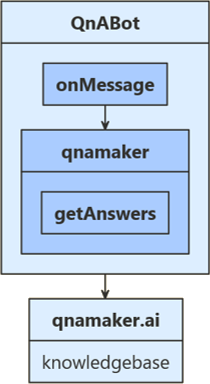

# KM BOT: - A CONVERSATIONAL CHATBOT TO ANSWER USER QUERIES 


> ### Contents :-
 >>  1. _Problem Statement_
 >>  2. _Introduction_
 >>  3. _Getting Started_
 >>  4. _Scope of Work_ 
 >>  5. _Technologies Used_ 
 >>  6. _Findings and Recommendations_ 
 >>  7. _Conclusion_ 

<br>
<br>
<br>

## Problem Statement :- 
<br>
<!-- <br> -->

#### The aim is to create a conversational chatbot with the help of Various Microsoft Tools including “Microsoft Power Platform” and the power tools supported by the Microsoft Bot Framework such as Power Virtual Agent, Power Automate, QnA maker, Bot Framework SharePoint integration and Bing SharePoint API (Application Programming Interface) to help the user with answers to any kind of queries asked.
<br>

## Introduction :- 
<!-- <br> -->

Artificial intelligence (AI) is making our world better in many ways. Among the most important of these is the rise of conversational AI, the ability for us to interact with software using natural language. Rather than relying on traditional graphical interfaces, we can now communicate with applications using ordinary sentences, much like talking with a person.  

 
A Chatbot interacts with users through a conversational interface, much like a person would. 

Chatbots offer some benefits such as: - 

> **They help in optimizing cost by automating service.** 
> **They improve customer satisfaction.** 
> **They also provide 24/7 customer service.** 

However earlier software developers were required to develop a chatbot. Integrating the backend would also be a tedious task. 
This problem is solved by the Microsoft power tools which provides business-oriented tools for building chatbots, infrastructure for running those chatbots, and ways to connect with other software. 
Microsoft Power Platform and Tools supports the “Low Code No Code” chatbot creation in order to help the users with the support they need.  

Power Virtual Agents addresses all three of the traditional barriers described earlier: 

> **1. Anyone can create chatbots : -** Power Virtual Agents provides graphical tools for creating chatbots. These tools are designed for anyone, not just pro developers, so even business users can create chatbots quickly and easily without writing code.  
>**2. Anyone can update chatbots : -** Rather than waiting for IT, chatbot authors can make changes as required. This helps chatbots stay up to date, since the people who know what should be changed can immediately make those updates.  
>**3. Bots can integrate with backend systems : -** Using graphical tools, Power Virtual Agents chatbots can access connectors to hundreds of existing services, including SharePoint, Office 365, Dynamics 365, Salesforce, and many more. Chatbots built using Power Virtual Agents can also access chatbots created using other technologies, whether from Microsoft or other vendors.   

 
Power Virtual Agents supports multiple channels, letting your chatbots interact with users through ordinary web pages, Facebook Messenger, Microsoft Teams, and other communication technologies.  

Power Virtual Agents chatbots can connect to other technologies. 

> **1. Using Power Virtual Agents with Power Automate** 
Power Automate, lets you create automated workflows using graphical tools. Like 	everything else in the Power Platform, these workflows— commonly called just flows—	are designed to be created by anyone within an organization. When required, a flow can 	use connectors to interact with other systems. 
Chatbot can call a flow, which in turn can use a connector to interact with this diverse set of services. 
#### Insert an Image >

> **2.Using Power Virtual Agent’s Connectors to Connect the Bot with Apps and Services**
Power Virtual Agents offers multiple connectors channels to connect the agent with ease by writing minimal or no code at all. Power Virtual Agents provides a feature that could let us integrate the bot with a Custom Website, Skype, Cortana, Slack, Telegram, Mobile App and many more. 
#### Insert an Image > 
> **3. Using Power Virtual Agents with Microsoft’s other chatbot offerings** 
Power Virtual Agents enables you to extend your bot using Microsoft Bot Framework skills. If you have already built and deployed bots in your organization (using Bot Framework pro-code tools) for specific scenarios, you can convert bots to a skill and embed the skill within a Power Virtual Agents bot 
Microsoft Bot Framework, a software development kit (SDK) that developers can use to build chatbots of any type. This framework underlies all of Microsoft’s chatbot offerings.  Azure Bot Service, a platform as a service (PaaS) offering for creating and running chatbots built on Bot Framework. 
#### Insert an Image > 

<br>

# Getting Started

The Bot We have built is a bot that uses Azure Resource Group and then retrives Data from the Knowledge base. 

// **TODO: Add info about Creating a resource group.** 


To get the Bot up and running in the local development environment we need to install tools called yeoman, bot-builder. Since this is heavily dependent of a specific version of python we need to have python 2.7 installed on our local development area. Once we have installed the required tool i.e. Python 2.7. We can use npm/dotnet tools to create the bot. 

Since we have some experience in working with JavaScript we used **npm** to build our bot. 

To install yeoman and bot builder we need to run the following command 

```

//Make a Directory to Store and Test Bots
$ mkdir myJsBots

//Navigate to that Directory
$ cd myJsBots

//Install latest version of npm
$ npm install -g npm

//Install generator bot Builder
$ npm install -g generator-botbuilder 

//(Optional) If you are using a windows device, then run the following command.
$ npm install -g windows-build-tools

//Install Yeoman for Generate and Interact with the Bots
$ npm install -g yo

```

To Create the Bot using Bot Builder we need to use the help of Yeo. 

Run the following command to trigger the creation of Bot
```
$ yo botbuilder

```
When the Command is Executed, a process runs into creating the bot. The Bot requires a few information from the user that is asked by Yeoman and they are : 


```
//What do we want to name our chatbot

? What's the name of your bot? my-chat-bot

//What are the core functionalities of out chatbot 

? What will your bot do? Demonstrate the core capabilities of the Microsoft Bot Framework

/* Language of our chatbot sourcecode: We can either use Javascript or Typescript. 
Since we were familiar with Javascript,we choose Javascript. */

? What programming language do you want to use? JavaScript

// The Botbuilder bot enables us to build 3 type of Bot 
// 1. Echo-Bot 
// 2. Core-Bot
// 3. Empty-Bot

/* Since we were Creating a bot that answers questions from our knowledge base 
we are going to select the Core-Bot option */

? Which template would you like to start with? Core-Bot

/* A final confirmation is prompted to create a bot and once "Yes" is typed,
we have our boiler plate code that contains the bot source code. */

? Looking good.  Shall I go ahead and create your new bot? Yes
```

Once out Bot is Created we get access to our Bot Source Code. 

The Architecture we are following is : 



